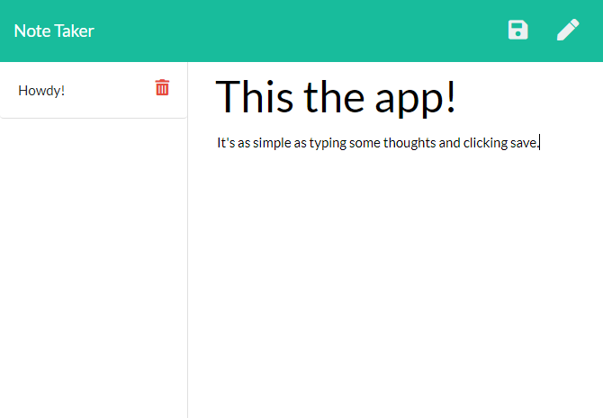

# Note Taker

## Description

Note Taker takes notes: it's as simple as that.

The app takes a title and body of a note and saves it for you on a server-side database. The app utilizes node express, fs, and other dependencies.

The app is deployed on Heroku here: https://radiant-temple-41601.herokuapp.com/

## Installation

Install dependencies by running the following command:
npm install

## Usage

You can run it using the following command:
npm start

This runs the server on your machine. It can be accessed at localhost:3000.

